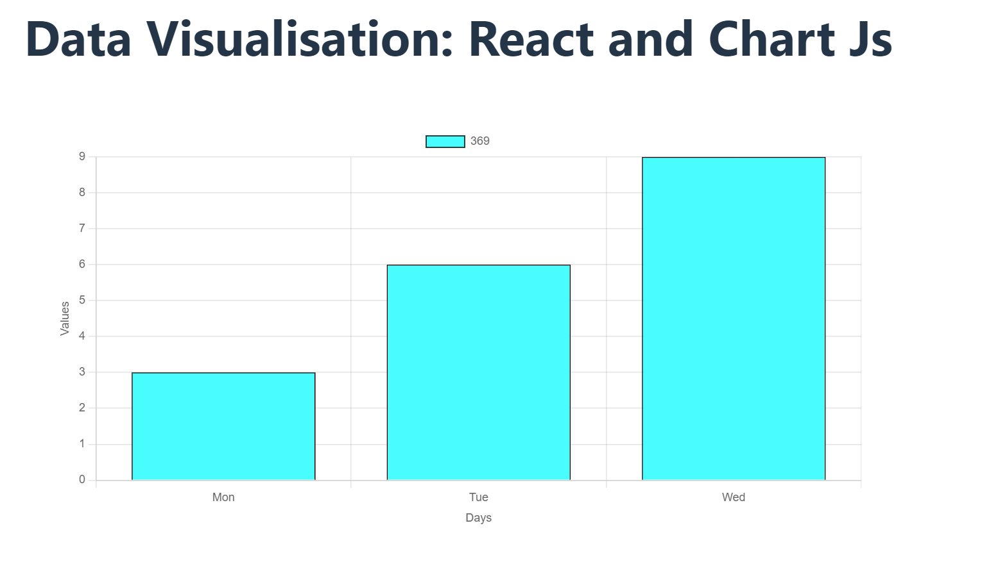

# React Chart.js App
This is a simple React application that demonstrates data visualization using Chart.js with the react-chartjs-2 library.

## Features
Displays a bar chart with sample data
Uses Chart.js for chart rendering
Styled with basic CSS
Prerequisites
Node.js and npm installed

## Installation
Clone the repository:

bash

git clone https://github.com/yourusername/react-chartjs-app.git
cd react-chartjs-app
Install dependencies:

bash

npm install
Running the App
Start the development server:

bash

npm start
Open your browser and go to http://localhost:3000 to see the app in action.

## Project Structure
java

react-chartjs-app/
├── node_modules/
├── public/
│   ├── index.html
│   └── ...
├── src/
│   ├── App.css
│   ├── App.js
│   ├── BarChart.js
│   └── index.js
├── .gitignore
├── package.json
└── README.md

## Code Overview
App.js
The main component of the application. It imports and uses the BarChart component to display the chart.

javascript

import React from 'react';
import './App.css';
import BarChart from './BarChart';

function App() {
  return (
    <>
      <h1>Data Visualisation: React and Chart Js</h1>
      

        <BarChart />
      

    </>
  );
}

export default App;
## BarChart.js
This component sets up the chart data and options, and renders the bar chart using the Bar component from react-chartjs-2

javascript

import React from 'react';
import {
  Chart as ChartJS,
  BarElement,
  CategoryScale,
  LinearScale,
  Tooltip,
  Legend
} from 'chart.js';
import { Bar } from 'react-chartjs-2';

ChartJS.register(
  BarElement,
  CategoryScale,
  LinearScale,
  Tooltip,
  Legend
);

function BarChart() {
  const data = {
    labels: ['Mon', 'Tue', 'Wed'],
    datasets: [{
      label: '369',
      data: [3, 6, 9],
      backgroundColor: 'aqua',
      borderColor: 'black',
      borderWidth: 1
    }]
  };

  const options = {
    responsive: true,
    plugins: {
      legend: {
        display: true,
        position: 'top',
      },
      tooltip: {
        enabled: true,
      },
    },
    scales: {
      x: {
        display: true,
        title: {
          display: true,
          text: 'Days',
        },
      },
      y: {
        display: true,
        title: {
          display: true,
          text: 'Values',
        },
        beginAtZero: true,
      },
    },
  };

  return (
    <Bar
      data={data}
      options={options}
    />
  );
}

export default BarChart;
## Dependencies
React
Chart.js
react-chartjs-2

## Usage 
Here is a screenshot of the barchart:

## License
This project is licensed under the MIT License. See the LICENSE file for more information.

Currently, two official plugins are available:

- [@vitejs/plugin-react](https://github.com/vitejs/vite-plugin-react/blob/main/packages/plugin-react/README.md) uses [Babel](https://babeljs.io/) for Fast Refresh
- [@vitejs/plugin-react-swc](https://github.com/vitejs/vite-plugin-react-swc) uses [SWC](https://swc.rs/) for Fast Refresh
